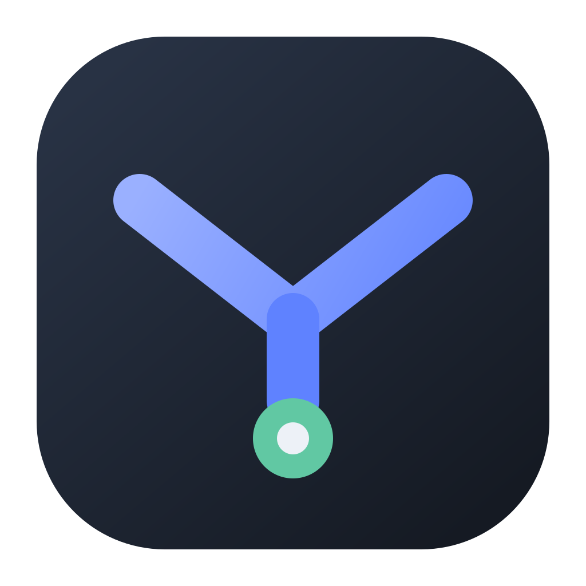
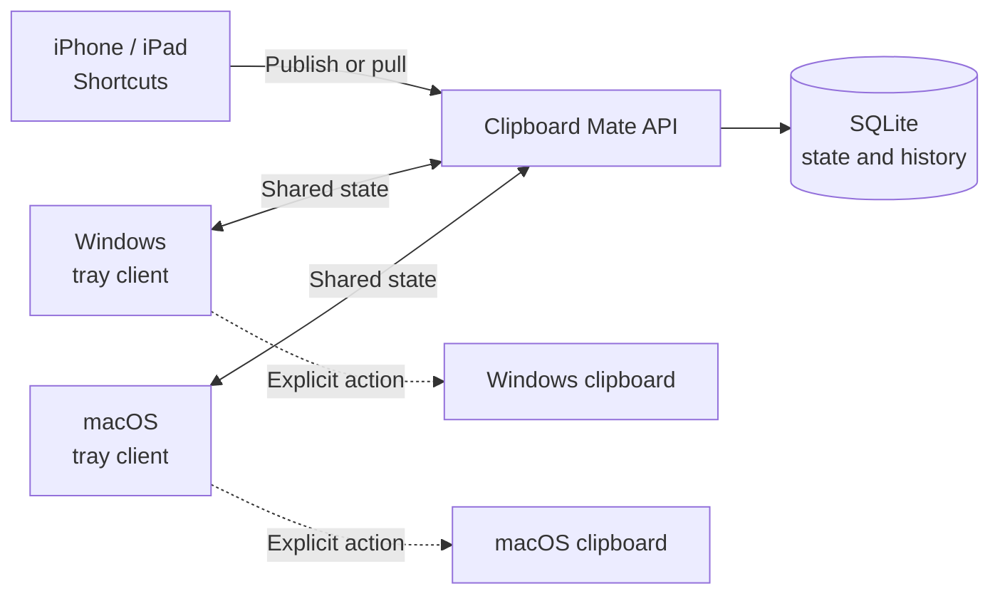

<div align="center">
  
  <h1>Clipboard Mate</h1>
  <p><strong>A deliberate, self-hosted clipboard relay for iPhone, Windows, and macOS.</strong></p>
  <p>Share text between your devices without background clipboard monitoring or automatic clipboard replacement.</p>
</div>

## Overview

Clipboard Mate keeps one shared text value, plus revision history, on a server
you control. Native desktop clients and iOS Shortcuts let you publish or retrieve
that value only when you explicitly request it.

Unlike automatic clipboard synchronizers, Clipboard Mate maintains a strict
boundary between its shared state and each device's local clipboard:

- remote updates never overwrite the operating-system clipboard;
- local clipboard contents are never monitored or uploaded in the background;
- reading or writing the local clipboard always requires a named user action;
- Maccy and Windows Clipboard History remain the local history managers.

> [!IMPORTANT]
> Clipboard contents and retained history are visible to the API server. This
> version does not provide end-to-end encryption.

## Features

- Explicit publish and pull operations with no background clipboard capture
- Windows and macOS tray client built with Electron
- iPhone and iPad integration through native Apple Shortcuts
- Authenticated, independently revocable credentials for each device
- Revision history with pinning and configurable retention
- Compare-and-swap editing to prevent silent stale overwrites
- Idempotent mutations for safe request retries
- Server-sent events with periodic refresh fallback
- Encrypted desktop credential and state storage through Electron `safeStorage`
- Self-hosted API backed by SQLite and packaged for Docker Compose
- Optional Cloudflare Access service-token support

## How It Works



The API is the source of truth for shared state. Desktop applications may
refresh and cache that state in the background, but cached API state is not the
same as the local clipboard. The clipboard is accessed only when the user
selects an explicit publish or copy action.

## Components

| Component | Technology | Responsibility |
| --- | --- | --- |
| API | Node.js, Fastify, SQLite | Authentication, current state, revision history, and events |
| Desktop | Electron, React | Windows/macOS tray interface, encrypted cache, and explicit clipboard actions |
| iOS integration | Apple Shortcuts | User-triggered publish and pull workflows |
| Contracts | TypeScript, Zod | Shared request, response, and configuration schemas |

## Quick Start

### Requirements

- Docker Engine with Docker Compose v2
- An authenticated HTTPS route for remote access
- A backup policy for the `clipboard-mate-data` volume

### Start the API

```powershell
Copy-Item .env.example .env
docker compose up -d --build
docker compose exec api node dist/cli/create-device.js --name "My device"
```

The final command prints a device ID and bearer token once. Store the token on
that device and retain the device ID for future revocation. Create a separate
credential for every desktop installation and Shortcut.

The API binds to `127.0.0.1:43120` on the Docker host by default. Publish it
through an authenticated HTTPS reverse proxy or Cloudflare Tunnel; do not expose
the container port directly to the internet.

See [Docker deployment](docs/deployment.md) for Cloudflare Access, updates,
backups, and credential revocation.

## Desktop Client

The desktop application runs as a tray popover and provides these operations:

| Action | Reads local clipboard | Writes local clipboard | Updates shared state |
| --- | :---: | :---: | :---: |
| Copy shared | No | Yes | No |
| Publish local clipboard | Yes | No | Yes |
| Publish typed text | No | No | Yes |
| Edit current | No | No | Yes |
| Clear shared state | No | No | Yes |

Build an unpacked application for the current platform:

```powershell
pnpm --filter @clipboard-mate/desktop package:dir
```

Platform-specific packaging commands and signing limitations are documented in
[Desktop builds](docs/desktop.md).

> [!WARNING]
> Current local desktop builds are unsigned. Windows SmartScreen and macOS
> Gatekeeper may warn users. Public binary distribution requires Windows code
> signing and Apple signing/notarization.

## iPhone and iPad

The iOS integration uses separate Shortcuts for publishing and pulling text, so
each invocation has one clear direction. Shortcut credentials must be treated
as secrets because anyone who can inspect or export a configured Shortcut can
recover them.

See [iOS Shortcuts](docs/ios-shortcuts.md) for setup instructions and the exact
API requests.

## Local Development

### Requirements

- Node.js 22 or later
- pnpm 11

Install dependencies and start the API:

```powershell
Copy-Item .env.example .env
pnpm install
pnpm device:create -- --name "Development device"
pnpm dev:api
```

In another terminal, start the desktop client:

```powershell
pnpm dev:desktop
```

Connect the client to `http://127.0.0.1:43120` using the generated development
token. Plain HTTP is accepted only for exact loopback development addresses;
remote API connections require HTTPS.

### Quality Checks

```powershell
pnpm typecheck
pnpm test
pnpm build
```

## Configuration

| Variable | Default | Description |
| --- | --- | --- |
| `CLIPBOARD_MATE_HOST` | `127.0.0.1` | API listener address outside Compose |
| `CLIPBOARD_MATE_PORT` | `43120` | API listener port |
| `CLIPBOARD_MATE_DB_PATH` | `./data/clipboard-mate.sqlite` | SQLite database path |
| `CLIPBOARD_MATE_HISTORY_LIMIT` | `250` | Number of unpinned revisions retained |
| `CLIPBOARD_MATE_MAX_TEXT_BYTES` | `262144` | Maximum UTF-8 text size |
| `CLIPBOARD_MATE_ALLOWED_ORIGIN` | empty | Optional browser CORS origin |
| `CLIPBOARD_MATE_BIND_ADDRESS` | `127.0.0.1` | Docker host interface receiving the published port |
| `CLIPBOARD_MATE_BIND_PORT` | `43120` | Docker host port |
| `CLIPBOARD_MATE_IMAGE` | `clipboard-mate-api:local` | Compose image name and tag |

Refer to [`.env.example`](.env.example) for the canonical configuration template.

## Security and Privacy

- Device credentials use random secrets and can be revoked independently.
- The API stores token hashes rather than bearer-token plaintext.
- Desktop credentials and cached state are encrypted with OS-backed storage.
- Remote desktop connections require HTTPS; HTTP is restricted to loopback.
- API responses containing shared state use `Cache-Control: no-store`.
- Request bodies and authentication headers are excluded or redacted from logs.
- Text size is bounded to 256 KiB by default.
- Docker binds to loopback by default and runs with a read-only filesystem,
  dropped capabilities, and `no-new-privileges`.

The API database and backups contain plaintext clipboard history. Protect the
host, volume, reverse proxy, credentials, and backup copies accordingly. A
Cloudflare Access service token can add an independent authentication layer at
the edge, but it does not replace the Clipboard Mate device token.

For the complete trust model, see [Architecture and privacy](docs/architecture.md).

## Documentation

- [Architecture and privacy model](docs/architecture.md)
- [Docker server deployment](docs/deployment.md)
- [Desktop builds](docs/desktop.md)
- [iOS Shortcut setup](docs/ios-shortcuts.md)

## Project Status

Clipboard Mate is currently a text-only project intended for one trusted user's
devices. The API, desktop client, and Shortcut contract are functional, but the
project should be treated as pre-release software. Public desktop distribution,
automatic updates, and end-to-end encryption are not currently implemented.

## License

No open-source license has been selected yet. Until a `LICENSE` file is added,
the source remains all rights reserved and may not be redistributed or modified
without permission.
