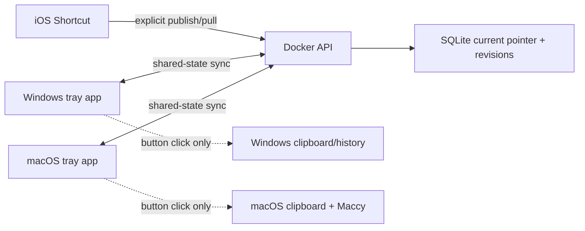

# Architecture and privacy model

## Product invariant

Clipboard Mate relays a value only after an explicit user decision. It is not a
universal clipboard synchronizer and is intentionally not a replacement for
Maccy or Windows Clipboard History.

There are two separate states:

1. **Shared state** is the current API value and its revision history. Desktop
   clients may download and cache this in the background so the tray popover is
   immediately useful.
2. **Local clipboard state** belongs to the operating system. Clipboard Mate
   reads or writes it only in response to a named button or Shortcut action.

Consequently, a remote update can change the tray display without changing the
machine's clipboard. Clipboard Mate does not watch for copy events, scrape
clipboard history, auto-publish, or auto-paste.

## Data flow

The desktop app uses server-sent events as an invalidation signal and performs
a normal authenticated fetch for content. A timed refresh is the fallback when
the event stream is interrupted. The latest successful state is retained in an
OS-backed encrypted cache, so it remains visible and copyable while temporarily
offline.

## Desktop tray behavior

The tray icon opens a small native desktop popover rather than a native menu,
because the interaction requires a text editor. It exposes these deliberate
operations:

| Action | Reads local clipboard | Writes local clipboard | Uploads shared state |
| --- | ---: | ---: | ---: |
| Open/refresh tray | No | No | No |
| Copy shared | No | Yes | No |
| Publish local clipboard | Yes | No | Yes |
| Publish typed text | No | No | Yes |
| Edit current | No | No | Yes |
| Clear shared state | No | No | Yes |
| Disconnect this app | No | No | No |

The popover continuously shows the most recent API state it knows, its revision,
origin device, and connection status. Editing uses compare-and-swap semantics:
if another device updates the value first, the stale edit is rejected rather
than silently overwriting it. Deliberate Shortcut pushes are last-writer-wins.

### Maccy and Windows Clipboard History

Clipboard Mate never queries or replaces either history manager. On macOS,
Maccy continues to collect normal local copy events. When **Copy shared** writes
a remote value to the macOS clipboard, Maccy may record that local write; this
is expected. A remote update that merely appears in the Clipboard Mate tray is
not injected into the clipboard and therefore does not enter Maccy. The same
relationship applies to Windows Clipboard History.

## Server state model

- There is one authoritative current state: `{ revision, value }`.
- `value` is either a text record or `null` when explicitly cleared.
- Every accepted publish or clear increments the monotonic revision and appends
  a history entry.
- Mutation UUIDs make retries idempotent. Reusing one UUID with different
  content is rejected.
- Normal desktop edits include `expectedRevision`; explicit force operations
  omit compare-and-swap only by declaring `force: true`.
- History retention is bounded by configuration; pinned entries and the current
  entry are preserved.

When retention prunes old revisions, the API enables SQLite `secure_delete` and
truncates the WAL after the deletion. This is best-effort local database
scrubbing, not a cryptographic erasure guarantee: filesystem snapshots, server
backups, and prior copies may still retain plaintext and need their own
retention policy.

An empty string and a cleared state are different. Empty text is a valid text
revision (`value.content == ""`); clearing produces `value == null`.

## Authentication and trust boundaries

Each installation should have a separate bearer token. The server stores a
SHA-256 token hash, not the original token, and tokens can be revoked
independently. Read and write scopes are enforced by the API. If Cloudflare
Access is enabled, its service-token headers authenticate the request at the
edge; the Clipboard Mate bearer token still authenticates the device at the
application.

The following data is intentionally server-visible:

- current shared text and retained history;
- device display name and state origin;
- update timestamps and revision identifiers.

This version does not provide end-to-end encryption. Use TLS, protect server
storage and backups, keep tokens private, and limit the API to authenticated
devices. On desktop, the connection credentials and cached state are encrypted
with the OS credential facilities via Electron `safeStorage`.

## API surface

All `/v1/*` endpoints require `Authorization: Bearer <device-token>`.

| Method | Path | Purpose |
| --- | --- | --- |
| `GET` | `/health` | Unauthenticated container/proxy health check |
| `GET` | `/v1/state` | Current structured state; supports `ETag` |
| `PUT` | `/v1/state` | Publish text with CAS or explicit force policy |
| `POST` | `/v1/state/clear` | Create an explicit cleared revision |
| `GET` | `/v1/history` | Paginated revision history |
| `PATCH` | `/v1/history/:revision/pin` | Retain/unretain a text revision |
| `GET` | `/v1/events` | Revision-only server-sent events |
| `GET` | `/v1/shortcut/latest` | Shortcut-friendly plain-text read |
| `POST` | `/v1/shortcut/push` | Shortcut-friendly explicit publish |

Responses containing shared state are marked `Cache-Control: no-store`.
